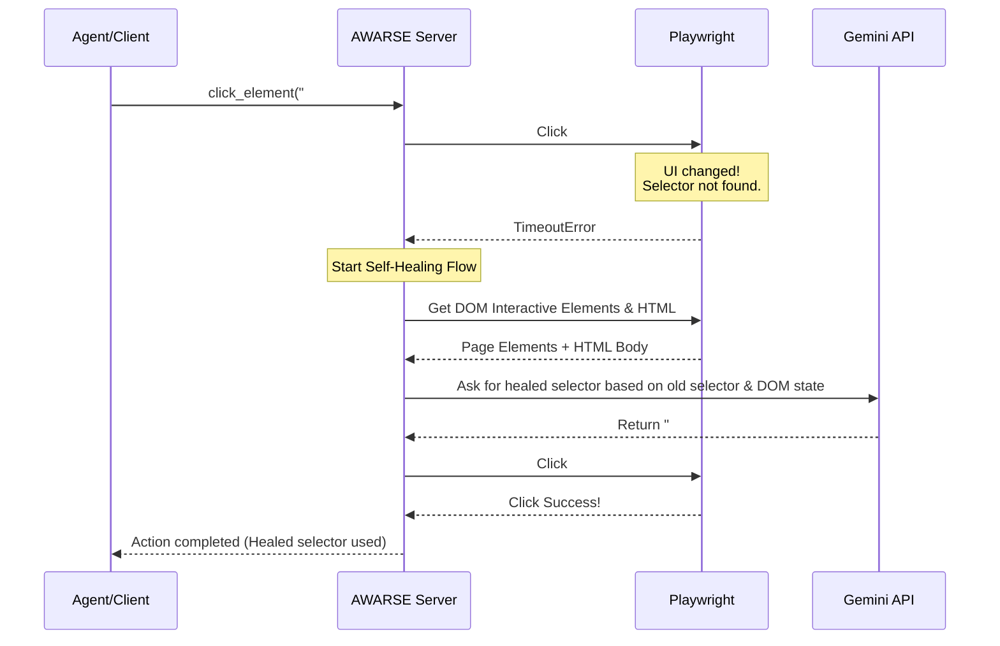

# AWARSE: Autonomous Web-Automation Runtime Self-Healing Engine

AWARSE is a Model Context Protocol (MCP) server that provides robust, self-healing browser automation tools powered by **Playwright** and the **Gemini API**. 

It eliminates fragile, flaky selectors in web scraping and testing scripts. When a locator (like a button ID or input name) breaks due to a UI redesign, AWARSE automatically captures the current DOM state, uses Gemini to locate the target element, repairs the selector in real-time, and completes the action seamlessly.

---

## Architecture Flow



---

## Exposed MCP Tools

The server exposes the following tools:

| Tool | Parameters | Description |
| :--- | :--- | :--- |
| `navigate` | `url` (string) | Directs the browser page to the specified URL. |
| `click_element` | `selector` (string) | Clicks an element. Automatically triggers self-healing if it fails. |
| `fill_element` | `selector` (string), `value` (string) | Fills a form input field. Automatically triggers self-healing if it fails. |
| `get_content` | *None* | Returns the textual body content (`innerText`) of the current page. |
| `evaluate_js` | `script` (string) | Evaluates custom JavaScript code on the page. |
| `take_screenshot`| `filename` (string) | Captures a screenshot of the current viewport and saves it locally. |

---

## Extended Capabilities: Resources & Prompts

In addition to tools, AWARSE exposes **Resources** (structured data read by the LLM) and **Prompts** (pre-defined templates for automation tasks).

### 1. Resources
* **`awarse://logs/healed-selectors`**: Exposes a real-time JSON log of all selectors successfully healed during the active session. This allows coding assistants to examine exactly what broke and what was repaired.
* **`awarse://page/dom`**: Exposes the token-efficient markdown element map of the active web page. Useful for LLMs to survey the page layout before proposing selectors.

### 2. Prompts
* **`diagnose_selector_failure(selector, action)`**: A troubleshooting assistant template that pulls the `awarse://logs/healed-selectors` resource, analyzes why the selector failed, and recommends code corrections.
* **`generate_playwright_test(url)`**: A test generator template that pulls the active layout map from `awarse://page/dom` and writes a complete, modern Playwright TypeScript test file.

---

## Setup & Installation

### 1. Prerequisites
Ensure you have the following installed on your system:
* Python 3.11+
* Node.js and `npm`

### 2. Install Dependencies
Create a virtual environment and install the required Python packages and browser binaries:
```bash
# Create virtual environment
python3 -m venv venv

# Activate and install packages
venv/bin/pip install playwright mcp google-antigravity python-dotenv

# Install Playwright browser binaries
venv/bin/playwright install chromium
```

### 3. Configure Environment Secret
Create a `.env` file in the root of the project directory:
```env
GEMINI_API_KEY="your-gemini-api-key"
GITHUB_PAT="your-github-pat"
```

---

## Verifying Self-Healing

The repository contains a mock page and script to verify that self-healing functions correctly:
1. **[test_page.html](test_page.html)**: A form containing a button that dynamically changes its ID and class names when a Javascript mutation is evaluated.
2. **[verify_healing.py](verify_healing.py)**: Navigates to the page, fills out the inputs, breaks the submit button selector via JS, attempts to click the old selector `#submit-btn`, triggers the healer, and successfully completes the click using the dynamically resolved selector.

Run the verification script:
```bash
venv/bin/python verify_healing.py
```

---

## Agentic Usage Example (Antigravity SDK)

We have provided a ready-to-run integration script **[example_use.py](example_use.py)** showing how to hook the AWARSE MCP server into a custom agent built on the **Google Antigravity SDK**. 

The script performs the following sequence:
1. Spawns an Antigravity agent configured with the AWARSE local Stdio MCP server.
2. Instructs the agent to navigate to `test_page.html`.
3. Commands the agent to fill in input fields.
4. Simulates a page redesign by evaluating `mutateDOM()` (breaking the selector).
5. Asks the agent to click the *original* selector (`#submit-btn`).
6. AWARSE intercepts the timeout error, invokes Gemini to heal it, and successfully clicks the newly generated selector (`#healed-submit-action-button`).

To execute this integrated agent test, run:
```bash
venv/bin/python example_use.py
```
---

## Customizing the Healer LLM Provider

AWARSE supports multiple LLM backends (Gemini, Claude/Anthropic, and OpenAI/Copilot/local models) to execute the healing process. You configure these by adding variables to your `.env` or client environment configuration:

### 1. Using Gemini (Default)
* Set `LLM_PROVIDER="gemini"`
* Set `GEMINI_API_KEY="your-api-key"`
* *(Optional)* Set `GEMINI_MODEL="gemini-2.5-flash"`

### 2. Using Claude (Anthropic)
* Set `LLM_PROVIDER="claude"` (or `"anthropic"`)
* Set `ANTHROPIC_API_KEY="your-api-key"`
* *(Optional)* Set `ANTHROPIC_MODEL="claude-3-5-haiku-latest"`

### 3. Using OpenAI / Copilot / Local Models (Ollama, vLLM)
* Set `LLM_PROVIDER="openai"`
* Set `OPENAI_API_KEY="your-api-key"`
* *(Optional)* Set `OPENAI_MODEL="gpt-4o-mini"`
* *(Optional)* Set `OPENAI_BASE_URL="http://localhost:11434/v1"` (to run Ollama locally or hook up custom Copilot/vLLM endpoints)

### 4. Token Efficiency Configuration
By default, AWARSE uses a highly token-efficient markdown layout snapshot (conceptually similar to `playwright-cli`). This filters out boilerplate HTML layout code and sends only relevant interactive elements to the LLM (typically reducing input token sizes by **80%–90%**).

You can toggle this mode using:
* `TOKEN_EFFICIENT_MODE="true"` (Default - uses optimized markdown element mapping)
* `TOKEN_EFFICIENT_MODE="false"` (Uses raw HTML body context + JSON DOM representation)

---

## How to Register AWARSE in your MCP Client

To register AWARSE with your preferred AI coding assistants (e.g., Claude Desktop, Cursor, VS Code, etc.), add the following server configuration to your `mcp_config.json` file:

```json
{
  "mcpServers": {
    "awarse": {
      "command": "/home/skildunne/MCP project/venv/bin/python",
      "args": [
        "/home/skildunne/MCP project/self_healing_server.py"
      ],
      "env": {
        "GEMINI_API_KEY": "YOUR_GEMINI_API_KEY_HERE"
      }
    }
  }
}
```
> **Note**: Update paths in the configuration block to point to your absolute paths.
